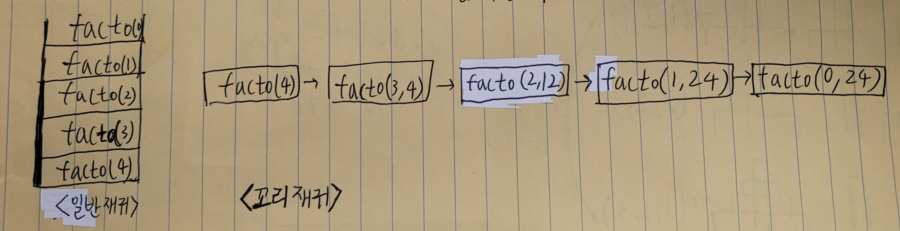

### 1. 일반재귀 vs 꼬리재귀 함수 호출



---

### 2. 꼬리 재귀 변환 3단계 공식
#### 꼬리 재귀 핵심 조건: `return`문에 함수 이외의 연산자나 값을 두면 안된다.


**1단계: 누적값(Accumulator) 매개변수 추가**

* 함수의 인자에 현재 상태나 중간 결과를 저장할 변수(`acc`)를 추가한다.

**2단계: Base Case(종료 조건)에서 누적값 반환**

* 지금까지 계산해 온 누적값(`acc`)을 그대로 리턴한다.

**3단계: Recursive Case에서 연산을 마친 뒤 다음 호출로 전달**

* 반환문(`return`) 위치에서 연산자를 제거하고, 인자 자리에서 연산을 끝낸 뒤 호출한다.
* 예: `return facto(n - 1) * n` $\rightarrow$ `return facto(n - 1, acc * n)`

---

### 3. 리스트 합 꼬리 재귀 풀이

`[1, 2, 3, 4]`의 합 계산

* **일반 재귀적 사고:**
`1 + sum([2, 3, 4])` $\rightarrow$ `sum([2, 3, 4])` 결과를 기다린 뒤 `1`을 더함.
* **꼬리 재귀적 사고:**
* 처음에 `acc`는 `0`, 남은 리스트는 `[1, 2, 3, 4]`
* `1`을 `acc`에 더함 $\rightarrow$ `acc`: `1`, 남은 리스트: `[2, 3, 4]`
* `2`를 `acc`에 더함 $\rightarrow$ `acc`: `3`, 남은 리스트: `[3, 4]`
* `3`을 `acc`에 더함 $\rightarrow$ `acc`: `6`, 남은 리스트: `[4]`
* `4`를 `acc`에 더함 $\rightarrow$ `acc`: `10`, 남은 리스트: `[]`
* 리스트가 비었으니 `acc` 안의 값 `10`을 바로 반환.

```python
# 일반 재귀 방식의 리스트 합 구하기
def sum_recursion(arr, idx):
    if (idx == len(arr)):
        return 0

    return arr[idx] + sum_recursion(arr, idx + 1)
```


```python
# 꼬리 재귀 방식의 리스트 합 구하기
def sum_tail1(arr, acc=0):
    if not arr:
        return acc

    sum_tail1(arr[1:], acc + arr[0])

def sum_tail2(arr, result, idx):
    if (idx == len(arr)):
        return result

    return sum_tail2(arr, result + arr[idx], idx + 1)
```
```python
arr = [1, 2, 3, 4]
sum_tail(arr, 0)
= sum_tail([2, 3, 4], 1)
= sum_tail([3, 4], 3)
= sum_tail([4], 6)
= sum_tail([], 10)
= 10
```

---

### 4. 피보나치 꼬리 재귀 풀이
```python

def fibo_tail(n, prev = 1, prevprev = 0):
    if (n == 0):
        return 0
    
    elif (n != 0 and n <= 2):
        return prev

    return fibo_tail(n - 1, prev + prevprev, prev)

```

```python
fibo_tail(5, 1, 0)
    = fibo_tail(4, 1, 1) 
    = fibo_tail(3, 2, 1) 
    = fibo_tail(2, 3, 2) 
    = fibo_tail(1, 5, 3) 
    = fibo_tail(0, 8, 5) 
    = 8
```

---
### 5. 팩토리얼 꼬리 재귀 풀이
```python

def facto_tail(n, acc = 1):
    if (n == 0):
        return acc

    return facto_tail(n - 1, n * acc)

```

```python
facto_tail(4, 1)
    = facto_tail(3, 4) ∵ 4 * 1 = 4
    = facto_tail(2, 12) ∵ 3 * 4 = 12
    = facto_tail(1, 24) ∵ 2 * 12 = 24
    = facto_tail(0, 24) ∵ n == 0 
    = 24
```
---


**notice: 파이썬은 꼬리 재귀 최적화(TCO)를 지원하지 않아 스택 프레임이 실제로 줄어들지는 않는다**
> https://velog.io/@whjoon0225/재귀의-최적화-Optimization-of-Recursion


**[참고자료]**
> [https://joooing.tistory.com/entry/%EC%9E%AC%EA%B7%80-%E2%86%92-%EA%BC%AC%EB%A6%AC-%EC%9E%AC%EA%B7%80-Tail-Recursion]

> [https://homoefficio.github.io/2015/07/27/%EC%9E%AC%EA%B7%80-%EB%B0%98%EB%B3%B5-Tail-Recursion/]